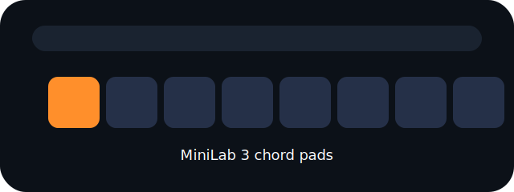

# ChordLab — MiniLab 3 Chord Builder

Transform the Arturia MiniLab 3 into a performance-ready chord workstation. ChordLab ships with a Python MIDI engine, WebMIDI control surface, and utilities for lighting the pads / OLED display with live feedback.



> This repository mirrors the structure described in the project brief. Each tool can run independently or be combined for a full live setup.

---

## Project Layout

| Path | Description |
| --- | --- |
| `chord_builder.py` | Python chord engine that interprets pad/keyboard input and emits harmonised chords |
| `minilab3_display_colors.py` | Helpers for building SysEx payloads that light the pads and update the OLED |
| `midi_logger.py` | Simple CLI utility for mirroring and debugging MIDI traffic |
| `tests/` | Pytest suite covering the core chord engine behaviour |
| `minilab-ui/` | Vite + React WebMIDI dashboard for pushing pad colours and OLED text |
| `assets/` | Visual assets referenced in documentation |
| `PROJECT_BRIEF.md` | Project brief with hardware mapping and goals |

---

## Getting Started (Python Engine)

### 1. Install dependencies

```bash
python3 -m venv .venv
source .venv/bin/activate
pip install -e .[dev]
```

> The repository ships with a tiny `mido_stub` so tests can run without system MIDI drivers. For real hardware interaction, install the official `mido` package.

### 2. Run the chord engine in a DAW setup

```python
from mido import open_input, open_output
from chord_builder import MiniLabChordEngine

with open_input('MiniLab3 In') as in_port, open_output('IAC Driver ChordOut') as out_port:
    engine = MiniLabChordEngine(out_port)
    for message in in_port:
        engine.process_message(message)
```

### 3. Running the tests

```bash
pytest
```

### 4. CLI runner

Run the engine without writing any Python glue:

```bash
# List ports
python run_engine.py --list

# Auto-pick ports (MiniLab for input/feedback, IAC for output)
python run_engine.py --auto

# Or specify ports explicitly
python run_engine.py --in "MiniLab" --out "IAC Driver Bus 1" --fb "MiniLab"
```

### 5. One command to run everything

If you want the Python engine *and* the WebMIDI UI launched together (with pad
channels normalised automatically), use:

```bash
python start_chordlab_stack.py
```

This will:

* ensure the Web UI dependencies are installed (runs `npm install` if needed)
* start the engine with `--auto` and pad note remapping enabled
* start the Vite dev server for the UI
* open the UI in your default browser at `http://localhost:5173/`

Press `Ctrl+C` in that terminal to stop both processes.

---

## Web UI (WebMIDI)

The `minilab-ui` directory contains the React/WebMIDI console. It only permits local origins (http://localhost or https://localhost).

```bash
cd minilab-ui
npm install
npm run dev
```

The first visit shows a permission banner. Click **Request MIDI + SysEx** to grant access; once granted the status chip flips to *ready* and available inputs/outputs are listed.

### Permissions & secure context
- Browsers block WebMIDI on `file://` – always serve from localhost.
- Chrome or Edge on desktop are recommended. Safari still gates SysEx behind experimental flags.
- The UI exposes a manual permission button (`requestMIDIAccess({ sysex: true })`) so you can re-authorise at any point.

### Chord modifiers & sliders
- Four sliders map 1:1 to the Python engine modifiers (CC82, CC83, CC85, CC17).
- Values are stored as 0–1 floats. Complexity/tension snap to four discrete stages, octave doubling snaps to {-24, -12, 0, +12, +24}. Spread spans 0–24 semitone widening.
- Moving the hardware faders updates the UI within ≈16 ms and dragging the UI slider emits the matching CC back to the MiniLab within ≈50 ms.

### Pad mapping & colour mirror
- Pads 21–28 mirror chord types (`maj → aug`). Default mapping listens for notes 36–43 on MIDI channel 9 (zero-based 8).
- Hardware presses light the matching tile in the UI and push the stored RGB back to the pad via SysEx + NoteOn/Off. Clicking a tile triggers the same message flow.

### Learn mode & mapping persistence
- Every pad/slider/encoder row has a **Learn** button. The next incoming event rebinds that control and is persisted to `localStorage['chordlab.midiMapping.v1']`.
- Defaults ship for the eight pads and four sliders so the UI works out of the box even without learning.
- Encoder bindings include optional parameter targets and mode overrides; overrides survive reloads.

### Encoders
- Encoder movement is normalised through the `EncoderTracker`. The first six samples infer absolute vs. relative mode (two’s complement, sign magnitude, 1/127).
- Signed deltas drive whichever parameter the encoder is assigned to. You can override the mode per encoder if the guess is wrong.

### OLED editor
- Both lines accept 16 ASCII characters. The **Send OLED Text** button pushes a SysEx packet using the MiniLab header (`F0 00 20 6B 7F 42 … F7`).

### Engine loop vs. standalone UI
- To keep pads/LEDs in sync with the Python engine, run `python run_engine.py --auto` (or the stack script) so pad presses flow through the engine and back to the MiniLab output.
- Running only the UI is also supported; it will talk directly to the controller when an output is selected.

---

## Utilities

### MIDI Logger

List available input ports and monitor data flowing through them while optionally forwarding to another destination:

```bash
python midi_logger.py "MiniLab3 In" "IAC Driver ChordOut"
```

### SysEx Helpers

Generate raw SysEx payloads for use with other tools or hardware testing rigs:

```python
from minilab3_display_colors import RGB, build_pad_color_sysex

sysex = build_pad_color_sysex('PAD_21', RGB(120, 40, 10))
```

---

## License

MIT — see `LICENSE` for details.
